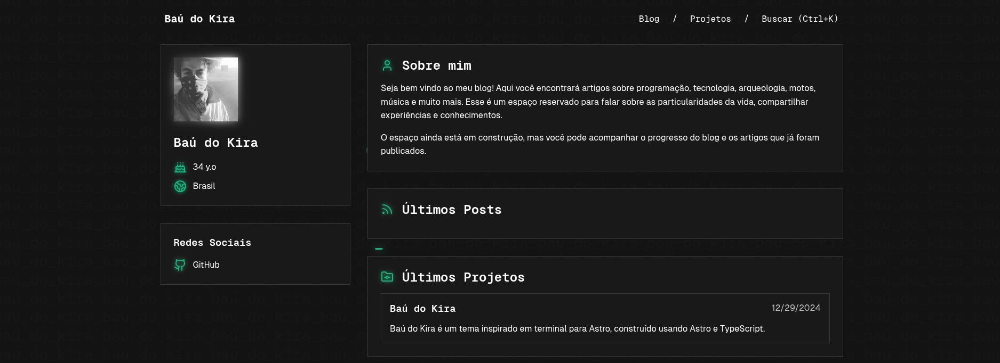

# Baú do Kira



Um blog pessoal minimalista inspirado em terminal, construído com [Astro](https://astro.build) e TypeScript.

## ✨ Funcionalidades

- 🚀 **100/100 no Lighthouse** - Performance otimizada
- 📱 **Responsivo** - Adaptável a todos os tamanhos de tela
- ♿ **Acessível** - Navegação completa por teclado e compatível com leitores de tela
- 🔍 **Busca integrada** - Powered by [Pagefind](https://pagefind.app)
- 📝 **Markdown/MDX** - Suporte completo para escrita de posts
- 🎨 **Tema escuro** - Design minimalista em modo escuro
- 🗺️ **Sitemap automático** - SEO otimizado
- 📦 **Content Collections** - Posts e projetos organizados
- 🔒 **TypeScript** - Código type-safe

## 🚀 Começando

### Pré-requisitos

- **Node.js 22.12+** (exigência do Astro 7)
- **npm** (gerenciador de pacotes oficial do projeto)

> O projeto **não** usa pnpm — a configuração npm está centralizada no arquivo `.npmrc` da raiz.

### Instalação

```bash
# Clonar o repositório
git clone https://github.com/SpetsnazBR/blog.git
cd blog

# Instalar dependências (node_modules fica contido no projeto)
npm install
```

### Configuração npm (`.npmrc`)

O arquivo `.npmrc` na raiz garante que o **cache do npm fique contido no projeto** (`./.npm`), sem escrever em `~/.npm`:

```ini
cache=./.npm
fund=false
```

## 📁 Estrutura do Projeto

```
├── public/                # Arquivos estáticos (favicon, fontes, imagens OG)
├── package/               # Integração Spectre (módulo virtual "spectre:globals")
│   └── src/               # Código-fonte da integração (Zod + plugin Vite)
├── src/
│   ├── components/        # Componentes Astro (Card, Icon, Navbar, ...)
│   ├── content/           # Conteúdo local (MDX/JSON)
│   │   ├── other/         # Página sobre
│   │   └── projects/      # Projetos
│   ├── layouts/           # Layout principal
│   ├── lib/               # Utilitários (ex.: reading-time.ts)
│   ├── pages/             # Páginas e rotas
│   ├── scripts/           # Scripts client-side
│   └── styles/            # Estilos CSS
├── tests/                 # Testes unitários (node:test)
├── .npmrc                 # Configuração npm (cache contido no projeto)
├── astro.config.ts        # Configuração do Astro
├── package.json
└── tsconfig.json
```

## 📝 Criando Posts

Crie um arquivo em `src/content/posts/` seguindo o formato:

```mdx
---
title: "Título do Post"
description: "Descrição do post"
createdAt: 2024-01-01
tags: ["tag1", "tag2"]
image: "./imagem.png"
draft: false
---

Conteúdo do post aqui...
```

## 🧪 Testes

O projeto usa o **test runner nativo do Node.js** (`node:test`) — sem dependências extras.

| Comando | Descrição |
|---------|-----------|
| `npm test` | Executa todos os testes unitários |
| `npm run test:unit` | Alias para `npm test` |
| `npm run test:security` | Auditoria de segurança das dependências (`npm audit`) |

**Suítes existentes (`tests/`):**
- `reading-time.test.ts` — função `timeToRead` (estimativa de tempo de leitura)
- `sanity-removed.test.ts` — testes de regressão garantindo que o Sanity CMS não volte ao projeto

## 🛠️ Scripts Disponíveis

### Scripts npm

| Comando | Descrição |
|---------|-----------|
| `npm run dev` | Inicia servidor de desenvolvimento |
| `npm run build` | Build estático para produção |
| `npm run start` | Preview do build estático (alias de `preview`) |
| `npm run preview` | Preview do build estático |
| `npm run lint` | Verifica código com Biome |
| `npm run lint:fix` | Corrige problemas automaticamente |
| `npm test` | Executa testes unitários |
| `npm run test:security` | Auditoria de segurança (`npm audit`) |

### Scripts Shell (.sh)

O projeto inclui scripts shell para facilitar o gerenciamento do servidor:

#### `run-servers.sh` - Script principal para executar o servidor

Este script inicia o servidor do Astro Blog.

**Uso básico:**
```bash
# Executar com todas as verificações
./run-servers.sh
```

**Opções disponíveis:**
```bash
# Mostrar ajuda
./run-servers.sh --help

# Mostrar versão
./run-servers.sh --version

# Executar sem verificar dependências
./run-servers.sh --no-check
```

**Funcionalidades do script:**
- ✅ Verifica se Node.js e npm estão instalados
- ✅ Verifica dependências do projeto
- ✅ Oferece instalação automática de dependências se necessário
- ✅ Inicia servidor Astro Blog na porta 3334
- ✅ Gerencia processos e limpeza automática ao encerrar
- ✅ Interface colorida com timestamps
- ✅ Tratamento de erros e sinais de sistema

**Servidor iniciado:**
- Astro Blog: http://localhost:3334

#### `test-servers.sh` - Script de teste

Este script testa as funcionalidades básicas do `run-servers.sh` sem executar o servidor.

**Uso:**
```bash
# Executar testes
./test-servers.sh
```

**Testes realizados:**
- ✅ Verificação de sintaxe do script
- ✅ Teste da opção de ajuda (`--help`)
- ✅ Teste da opção de versão (`--version`)
- ✅ Tratamento de argumentos inválidos
- ✅ Verificação de permissões de execução
- ✅ Verificação da estrutura do projeto
- ✅ Verificação de permissões do script de teste

**Configuração inicial:**
```bash
# Tornar os scripts executáveis (se necessário)
chmod +x run-servers.sh test-servers.sh

# Executar teste primeiro
./test-servers.sh

# Se tudo estiver OK, executar o servidor
./run-servers.sh
```

## 🧪 Fluxo de Trabalho Recomendado

1. **Configuração inicial:**
   ```bash
   git clone https://github.com/SpetsnazBR/blog.git
   cd blog
   npm install
   ```

2. **Testar scripts:**
   ```bash
   chmod +x run-servers.sh test-servers.sh
   ./test-servers.sh
   npm test
   ```

3. **Iniciar desenvolvimento:**
   ```bash
   ./run-servers.sh
   # Ou para desenvolvimento rápido:
   ./run-servers.sh --no-check
   ```

4. **Acessar o servidor:**
   - Blog: http://localhost:3334

## 🚀 Deploy (GitHub Pages)

O site é **100% estático** (sem servidor/adapter Node) e publica automaticamente via **GitHub Actions** a cada push na branch `master`.

### Configuração única (no GitHub)

1. Vá em **Settings → Pages** do repositório
2. Em **Build and deployment → Source**, selecione **"GitHub Actions"**
3. (Opcional) Em **Custom domain**, adicione seu domínio (ex.: `spectre.lou.gg`) — o workflow gera os arquivos para servir na raiz
4. O workflow `.github/workflows/deploy.yml` roda `npm ci` + `npm run build` e publica `dist/`

### Fluxo de publicação

```bash
git push origin master   # → build + deploy automático
```

> **Nota:** o `astro.config.ts` define `site: 'https://spectre.lou.gg'`. Se você publicar sem domínio customizado (na URL `https://SEU_USUARIO.github.io/blog/`), adicione `base: '/blog/'` no `astro.config.ts` para os assets funcionarem corretamente.

## 🙏 Créditos

Este projeto é baseado no tema [Spectre](https://github.com/louisescher/spectre) por [Louise Scherer](https://github.com/louisescher).

## 📄 Licença

MIT License
